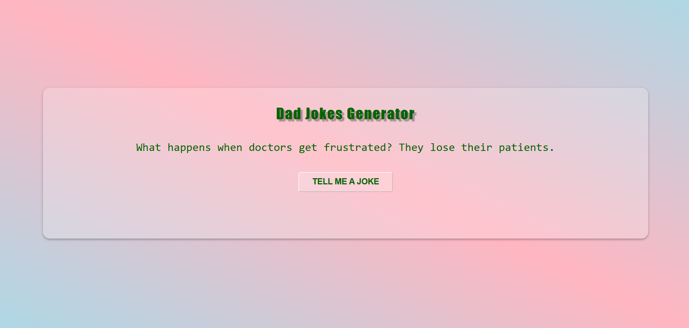

# 😂 Dad Joke Generator

This is a simple and fun web app that fetches and displays random dad jokes using the [API Ninjas Dad Jokes API](https://api-ninjas.com/api/dadjokes).

👉 **Live Demo**: [https://kumar-veerendra.github.io/dad-joke-generator/](https://kumar-veerendra.github.io/dad-joke-generator/)

---

## 📸 Screenshot



---

## 🚀 Features

- 🃏 Random dad joke fetch
- 🔄 Joke updates on button click
- ⌛ Loading states with text updates
- 🎯 Clean and minimal UI

---

## 🛠️ Tech Stack

- HTML5
- CSS3
- JavaScript (ES6)
- GitHub Pages for hosting

---

## 🔐 API Used

- [API Ninjas - Dad Jokes](https://api-ninjas.com/api/dadjokes)

You need an API key. Replace your key inside `script.js`:
```js
const apiKey = "your_api_key_here";
```

---

## 📁 Project Structure

```
dad-joke-generator/
├── index.html
├── style.css
├── script.js
├── README.md
└── screenshot.png
```

---

## 🚀 How to Run Locally

```bash
git clone https://github.com/kumar-veerendra/dad-joke-generator.git
cd dad-joke-generator
open index.html
```

---

## ✨ Author

**Veerendra Kumar**  
🔗 [My Portfolio](https://veerendrakumar-portfolio.netlify.app/)

---

## 📜 License

Licensed under the [MIT License](LICENSE).
